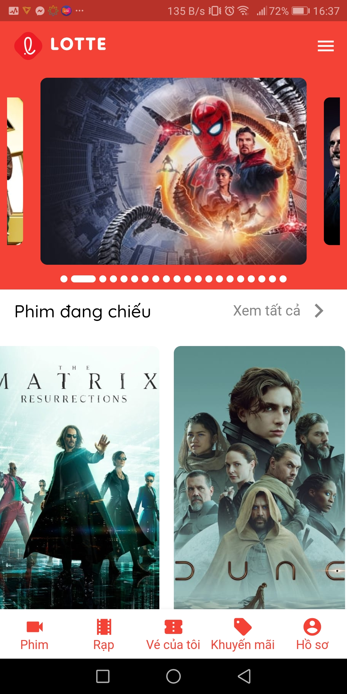

<h1  align="center">Dotte Cinema </h1>

  

> A movie cinema booking application, clone Lotte Cinema, but improve UI.

## Built with
This application use:

 - [TheMovieDB](https://www.themoviedb.org/) API for trending film information.
 - Applied [Flutter Architecture Blueprints](https://github.com/wasabeef/flutter-architecture-blueprints) recommendation.

## Demo

## Author

👤 **DucThu-Dev**

  

* Website: https://github.com/DucThu-Dev

* Github: [@DucThu-Dev](https://github.com/DucThu-Dev)

* LinkedIn: [@Trần Đức Thư](https://linkedin.com/in/Trần Đức Thư)

  

## Show your support

  

Give a ⭐️ if this project helped you!

  

***

_This README was generated with ❤️ by [readme-md-generator](https://github.com/kefranabg/readme-md-generator)_